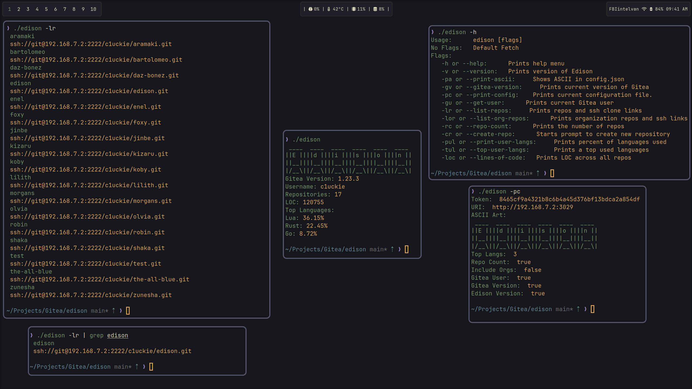

<div align="center">

# Edison
Named after one of the Vegapunk satellites from One Piece. Edison is a Gitea CLI fetch tool written in Go using the Gitea SDK.
</div>
<hr>

## Purpose
Just a small CLI I use to keep my workflow inside the CLI.

## Build
Clone repo.
```sh
go build -ldflags="-s -w"
```

## Usage
1. Create an API token
2. Add the Gitea API token and URI to your config.json
3. run `edison` or `edison -h`

## Configuration
Default JSON configuration
```json
{
  "token": "gitea_app_token",
  "URI": "gitea_uri",
  "ascii_art": [
    " ____  ____  ____  ____  ____  ____ ",
    "||E ||||d ||||i ||||s ||||o ||||n ||",
    "||__||||__||||__||||__||||__||||__||",
    "|/__\\||/__\\||/__\\||/__\\||/__\\||/__\\|"
  ],
  "top_langs": 3,
  "repo_count": true,
  "include_orgs": false,
  "gitea_user": true,
  "gitea_version": true,
  "edison_version": true
}
```

## Exmaple


## Contributions
Sure.
